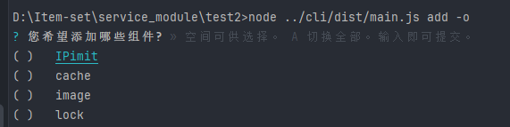

=== 组件安装cli ===


##项目部署
**运行环境**
- `系统` CentOS 、windows 、macOS
- `node` 14~16.18.0
- `npm` 8.5.5+

**部署命令**
```shell
# 安装依赖
npm install || yarn install

# 开发环境
npm run dev

# 初始化
npx depbox init

# 安装依赖
npx depbox add [组件名或空]

```

#### 选择组件安装


## 常用命令

```
```
